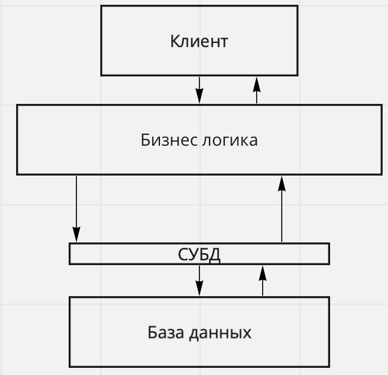

# 1. База данных как компонент информационной системы. Определение понятия данные, функции ИС. Абстрагирование данных от методов их обработки. Многозвенная архитектура ИС

`def` **Информационная система** - совокупность аппаратных и программных компонентов, связанных с обработкой информации (ПО + данные + люди + железо)

`def` **Данные** - это поддающиеся многократной интерпретации представления информации в **формализованном** виде, пригодные для передачи, интерпретации и обработки

(с) ISO стандарт

___

**Функции ИС**

1. Сбор
2. Хранение
3. Обработка
4. Представление
5. Передача

___

:::tip
Данные **абстрагируются** от бизнес-логики, в связи с этим возникают проблемы с доступом к данным
:::

Если есть много приложений, которые хотят обратиться к данным, доступ будет выдан единовременно только одному приложению - иначе возникает риск тупиков.

:::tip
Над данными надстраивается слой, который нам обеспечивает доступ к данным - СУБД
:::

Получаем следующую структуру: `Клиент -> БизнесЛогика -> Доступ к данным (Данные)`

`def` **Система управления базами данных (СУБД)** — совокупность программных и лингвистических средств общего или специального назначения, обеспечивающих управление созданием и использованием баз данных

___

`def` **Многозвенная архитектура** - это архитектура, подразумевающая разделение компонентов на функциональные группы

Выделяется 2 вида многозвенной архитектуры

1. Толстый клиент
    Клиент запрашивает данные, сервер возвращает данные в необработанном виде, и клиент обрабатывает их на своей стороне

2. Тонкий клиент
    Клиент запрашивает данные, они обрабатываются на стороне сервера, и возвращаются уже в готовом виде

Порядок выполнения запроса в многозвенной архитектуре будет следующим: `Запрос -> СУБД -> БД`

