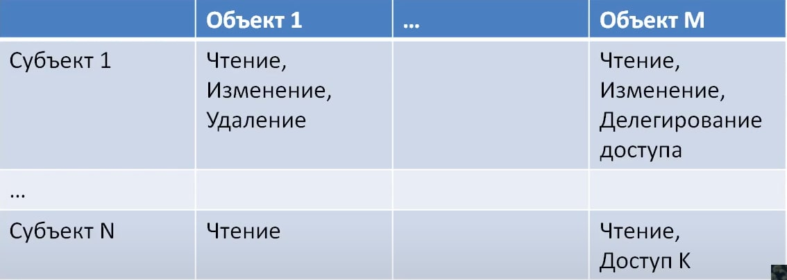

# 25. Иерархия уровней безопасности по оранжевой книге. Понятия идентификации и аутентификации

`def` **Безопасная компьютерная система** - посредством специальных механизмов защиты контролируется доступ к информации, таким образом, что только имеющие соответствующие полномочия лица или процессы, выполняющиеся от их имени, могут получить доступ на чтение, изменение, создание или удаление информации.

:::tip
Существует 4 основных уровня, но некоторые имеют свои подуровни
:::

## Уровень D

:::tip
Когда система не попадает ни в один из описанных классов
:::

## Уровень C

:::tip
Самый слабый из классов безопасности
:::

1. Подсистема идентификации и аутентификации

    - Идентификация - **присвоение** некоторых идентификаторов субъекту

        - То что субъект знает (кодовое слово)
        - То, что субъекту принадлежит (карта, токен)
        - То, что является его неотъемлемой характеристикой (биометрия)

    - Аутентификация - **сопоставление** предъявляемого идентификатора и того, который хранится в системе
    - Авторизация - **назначение** тех или иных прав доступа субъекту, прошедшему аутентификацию

::: details Иное определение терминов выше
**Аутентификация** (authentication, от греч. αὐθεντικός [authentikos] – реальный, подлинный; от αὐθέντης [authentes] - автор) — это процесс проверки учётных данных пользователя (логин/пароль). Проверка подлинности пользователя путём сравнения введённого им логина/пароля с данными сохранёнными в базе данных.

**Авторизация** (authorization — разрешение, уполномочивание) — это проверка прав пользователя на доступ к определенным ресурсам.
:::

2. Подсистема учёта событий, связанных с безопасностью

3. Избирательный (дискреционный) контроль доступа - в том или ином виде существует матрица вида: субъекты <-> объекты
  
    

### Уровень C1

1. Разделение пользователей и данных
2. Выделение контура обеспечения безопасности

    `def` **Доверенная вычислительная база** - совокупность защитных механизмов, включающих аппаратное и программное обеспечение, отвечающих за приведение в жизнь политики безопасности.

    :::tip
    По факту это наличие отдельного приложения / процесса, которое будет заниматься исключительно решением задач, связанных с безопасностью
    :::

3. Средства проверки корректности функционирования аппаратных и программных компонентов вычислительной базы (тест, что машина и программа аутентификации вообще работают)

### Уровень C2

1. **Журнал контроля доступа к системе**

    Журналируются действия пользователя

2. **Изоляция ресурсов**

    При выделении объекта из некого пула ресурсов доверенной вычислительной базы, затем удаляются следы его использования

3. **Проводится тестирование на отсутствие видимых недостатков в вышеуказанных в механизмах**

## Уровень B

Выяснилось, что получившему доступ субъекту можно нарушить конфиденциальность доступных ему данных, поэтому понадобилось добавить новый способ контроля доступа.

:::tip
Разглашение информации
:::

1. Мандатный доступ - каждому объекту ставится в соответствие метка секретности и какждому объекту тоже ставится такая метка

    - **Читать** данные можно своего **уровня и ниже**.
    - **Запись** данных на **свой уровень и выше**.

### Уровень B1

Мандатное управление доступом к выбранным субъектам и объектам _(не все объекты наделены уровнем доступа)_

### Уровень B2

Абсолютно любой субъект и объект должны быть классифицированы и включены в систему управления мандатным доступом

### Уровень B3

Поддержка B2, а также включение домена безопасности

**Домен безопасности** - наличие специального администратора безопасности и системы мониторинга безопасности _(только администратор имеет управление над присвоением классификаций)_

## Уровень A

Поддержка B3, а также формализованные процедуры проектирования, управления и распространения

Проверяем перед построением системы, что её безопасность действительно нельзя нарушить

